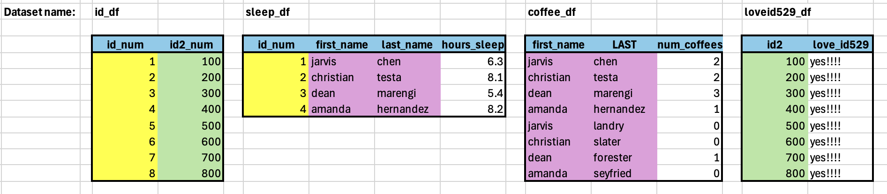

# A Gentle Introduction to Record Linkage

### To get strated:

- Clone this github repository
- Open `joining_data.Rproj` R project
 
## In-class example:

Example for writing R code to crosswalk across several datasets with different id's and join them together. 

- Open the `other_join_examples.R` R script
- Run the code, which references the `sample_data.xlsx` excel file included in the project directory
  - `sample_data.xlsx` includes 4 datasets, each stored on separate tabs in the excel file
  - The last tab in the file shows the 4 datasets side-by-side for reference

 
## Activity:

- Open the R script, `joining_data.R`
- Read through the comments included in the R script
    -  Run existing code
        -  Spend some time familiarizing yourself with how to implement joins
    -  Write some new code to explore different types of joins
 
